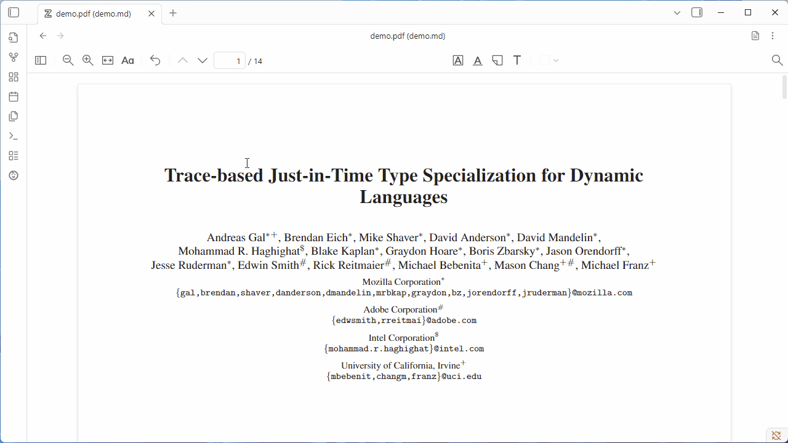
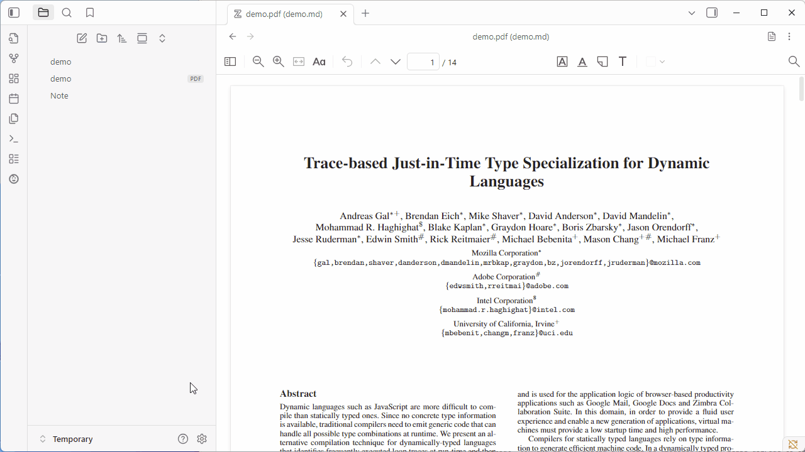
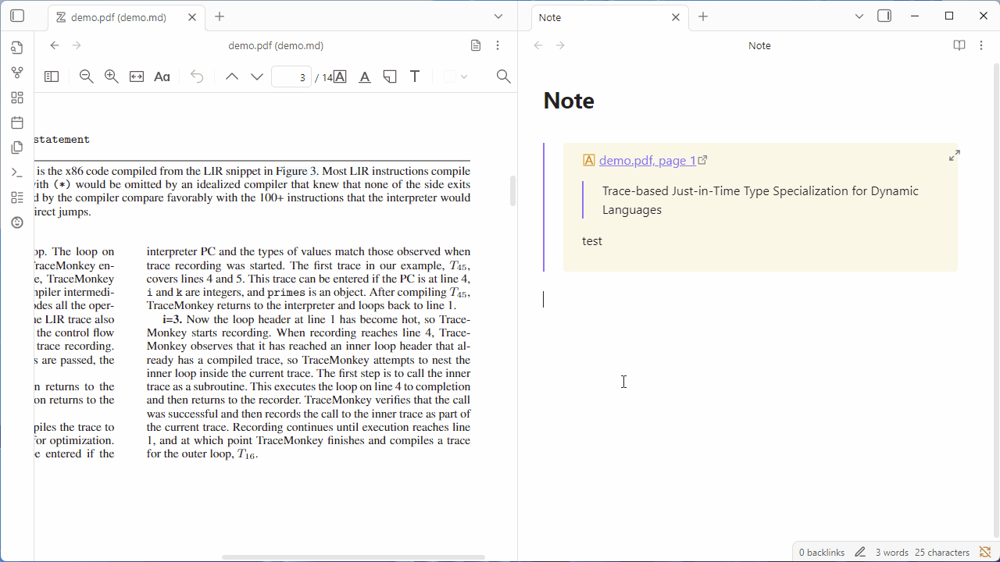

<h1 align="center">Obsidian Zotero Reader (Beta)</h1>
<div align="center">
	
[](https://github.com/duanxianpi/obsidian-zotero-reader-plugin/stargazers)
[](https://github.com/duanxianpi/obsidian-zotero-reader-plugin/issues)
[](https://github.com/duanxianpi/obsidian-zotero-reader-plugin/pulls)

[](https://discord.gg/KwTkAhVc)
 
</div>
Read and annotate PDFs/EPUB/HTML inside Obsidian with awesome Zotero Reader! This plugin adds the zotero reader and utilities for linking annotations back to your notes.

---

## Demo


---

## Installation (via BRAT)

> **Note:** This plugin is **not ready for production** yet. Install using the [Obsidian BRAT](https://github.com/TfTHacker/obsidian42-brat) plugin.

1. In Obsidian, open **Settings → Community plugins** and install **BRAT**.
2. In BRAT, choose **Add beta plugin** and enter the repo: `duanxianpi/obsidian-zotero-reader-plugin`.
3. Enable **Obsidian Zotero Reader** in your Community plugins list.

---

## Usage
1. Create a new md file
2. Add the following YAML frontmatter to the Markdown file. The `source` can point to a local `pdf`, `epub`, or `html` file inside Obsidian or network file.

```yaml
---
zotero-reader: true
source: path/to/file.pdf # or .epub / .html
---
```
source also support link like `\[\[path/to/file\]\]`

Then open the note and **click the icon in the top-right** to launch the reader.

### Annotation


### Theme


### Link


---

## Features

* **Add annotation** – Create annotations while viewing the document.
* **Copy link to annotation** – Grab a direct link to a specific annotation.
* **Copy link to selection** – Link to any text selection for precise references.
* **Annotate with Obsidian’s editor** – Annotate with Obsidian's Markdown editor directly!
* **Sync Color Theme** - Auto Sync the theme with Obsidian.
* **Pure Markdown** - No extra json, store with pure markdown.

---

## Development

> Make sure you have recent **Node.js** and **npm** installed.

One-time setup and full build:

```bash
npm install
npm run build:pdf.js
npm run build
```

Active development (run in parallel, separate terminals/tabs):

```bash
npm run dev:reader
npm run dev:plugin
```

* `build:pdf.js` – prepares bundled PDF.js assets.
* `dev:reader` – runs the zotero reader in watch mode.
* `dev:plugin` – builds the Obsidian plugin in watch mode.

---
## Acknowledgments

Special thanks to the [Zotero](https://github.com/zotero) team for the excellent application that inspired this plugin.

---

## Sponsor

Thanks for checking out the plugin! I’m currently a student and working on this plugin nights and weekends. If it’s useful to you, a small tip will help me keep shipping features.

<div>
	<a href="https://www.buymeacoffee.com/duanxianpi" target="_blank" title="buymeacoffee">
	  
	</a>
</div>


---

## Troubleshooting

* If the reader doesn’t open, double‑check the YAML frontmatter is valid and that `source` points to an existing file.
* After updating, try disabling/enabling the plugin or reloading Obsidian.

## Roadmap / Feedback

Have ideas or found a bug? Please join the discord server!
<a href="https://discord.gg/KwTkAhVc">  </a>

## Star History

[](https://www.star-history.com/#duanxianpi/obsidian-zotero-reader-plugin&Date)
