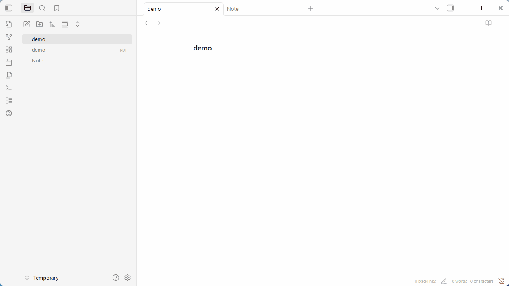

# Obsidian Zotero Reader (Beta)

[](https://github.com/duanxianpi/obsidian-zotero-reader-plugin/stargazers)
[](https://github.com/duanxianpi/obsidian-zotero-reader-plugin/issues)
[](https://github.com/duanxianpi/obsidian-zotero-reader-plugin/pulls)

[](https://buymeacoffee.com/duanxianpi)

Read and annotate PDFs/EPUB/HTML inside Obsidian with Zotero-powered convenience. This plugin adds a reader pane and utilities for linking annotations back to your notes.

---

## Demo

> **Drop your GIF here**
>
> Place a demo GIF at `docs/demo.gif` (or update the path) and it will render below.



---

## Installation (via BRAT)

> **Note:** This plugin is **not ready for production** yet. Install using the [Obsidian BRAT](https://github.com/TfTHacker/obsidian42-brat) plugin.

1. In Obsidian, open **Settings → Community plugins** and install **BRAT**.
2. In BRAT, choose **Add beta plugin** and enter the repo: `duanxianpi/obsidian-zotero-reader-plugin`.
3. Enable **Obsidian Zotero Reader** in your Community plugins list.

---

## Usage

Add the following YAML frontmatter to any Markdown file. The `source` can point to a local `pdf`, `epub`, or `html` file.

```yaml
---
zotero-reader: true
source: path/to/file.pdf # or .epub / .html
---
```

Then open the note and **click the icon in the top-right** to launch the reader.

---

## Features

* **Add annotation** – Create annotations while viewing the document.
* **Copy link to annotation** – Grab a direct link to a specific annotation.
* **Copy link to selection** – Link to any text selection for precise references.
* **Annotate with Obsidian’s editor** – Annotate with Obsidian's Markdown editor directly!

---

## Development

> Make sure you have recent **Node.js** and **npm** installed.

One-time setup and full build:

```bash
npm install
npm run build:pdf.js
npm run build
```

Active development (run in parallel, separate terminals/tabs):

```bash
npm run dev:reader
npm run dev:plugin
```

* `build:pdf.js` – prepares bundled PDF.js assets.
* `dev:reader` – runs the zotero reader in watch mode.
* `dev:plugin` – builds the Obsidian plugin in watch mode.

---

## Sponsor

If you find this useful, you can support development here:

👉 **[https://buymeacoffee.com/duanxianpi](https://buymeacoffee.com/duanxianpi)**

---

## Troubleshooting

* If the reader doesn’t open, double‑check the YAML frontmatter is valid and that `source` points to an existing file.
* After updating, try disabling/enabling the plugin or reloading Obsidian.

## Roadmap / Feedback

Have ideas or found a bug? Please join the discord server!

[](https://discord.gg/KwTkAhVc)
